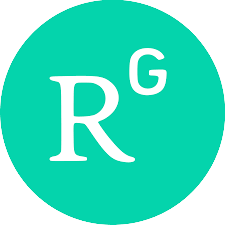

::: {.page-intro}
You can access the following repositories (social networks) to see all the publications throughout my career:
:::

|  |  |
|:---------------------:|:------------------------------------------------|
| [{target="_blank" width="64"}](https://www.researchgate.net/profile/Pablo-Rogers) | On [ResearchGate](https://www.researchgate.net/profile/Pablo-Rogers){target="_blank"} I keep archives of (practically) all my publications in English and Portuguese, and in journals and conferences 🤔. |
| [{target="_blank" width="64"}](https://scholar.google.com.br/citations?user=zFMZO5kAAAAJ&hl=pt-BR) | On [Google Scholar](https://scholar.google.com.br/citations?hl=pt-BR&user=zFMZO5kAAAAJ){target="_blank"} you may also be able to access (almost) all of my publications, but I don't monitor whether Alphabet is correct 😁. |
| [{target="_blank"}](https://www.zotero.org/phdpablo) | In my [Zotero profile](https://www.zotero.org/phdpablo){target="_blank"}, "things" are more organized 🤥. You will have access to my journal articles (in English and Portuguese) and you will be able to copy the citation in different styles and export it to BibTex and RIS. |

::: {.page-intro}
Anyway, below I present my publications in English that I consider most relevant (sorted by date).
:::

::: {.render-publications}
:::
