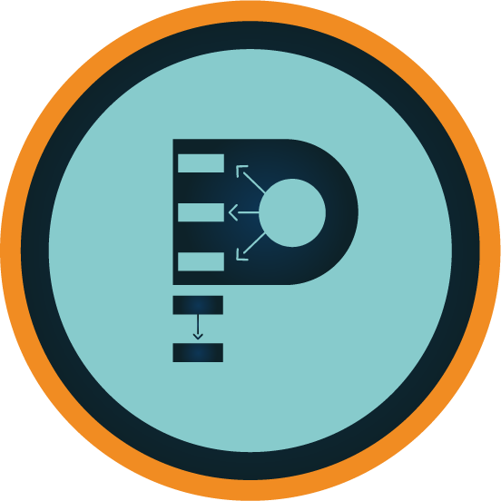

::: {.page-intro}
[**Psico&Econo_METRIA**](https://www.youtube.com/@PsicoEconoMETRIA) is an extension project of the Federal University of Uberlândia, which I coordinate. Its objective is the production and dissemination of science on YouTube, specifically focusing on methods, techniques, and quantitative modeling used by researchers in applied social sciences in Brazil, particularly in administration, accounting, economics, psychology, education, and related fields.
:::

[{width="250" style="float:left; margin-right:20px;"}](https://www.youtube.com/@PsicoEconoMETRIA)

With this project, we aim to translate the knowledge acquired from **Econometrics** and **Psychometrics** books into videos and accessible language for social scientists across Brazil. This will assist them in the decision-making, development, and execution of quantitative methodologies and data analysis for their master's dissertations, doctoral theses, research projects, and high-impact scientific articles.

My future goal is to have everything we are doing at [**Psico&Econo_METRIA**](https://www.youtube.com/@PsicoEconoMETRIA) organized and structured in this "corner" of the internet 🤞, and eventually create our own website for the project 🙌. In the meantime, if you want to know what we are up to, take a look at our [YouTube channel](https://www.youtube.com/@PsicoEconoMETRIA).
